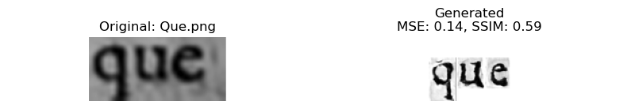

# Specific Test III. Synthetic Renaissance Text Generation with Generative Models

This project presents a mid-scale Conditional GAN (CGAN) based model to synthesize 17th-century Renaissance-style printed Spanish text. The model generates character-level grayscale images conditioned on input labels and assembles them into words, incorporating printing artifacts such as ink bleed, smudging, and fading.

---

## 🎯 Objective

Design a generative model to produce realistic Renaissance-era printed Spanish text with visible printing degradation effects. Evaluate the generated output against OCR-extracted words using both visual and quantitative metrics.

---

##  Dataset Preparation

1. **Character Collection**  
   - Manually cropped character images of uppercase (A–Z) and lowercase (a–z) letters  
   - Stored in `capital/` and `small/` directories

2. **Image Merging + Augmentation**  
   - Images copied into `training_data_gan/` with duplicate renaming  
   - Augmentation: rotations (±2°)  
   - Padding and resizing to 200×200 grayscale

3. **CSV Creation**  
   - `train.csv` generated with `FILENAME` and cleaned `IDENTITY` columns  
   - Identity mapping used for conditional generation

---

##  Model: Conditional GAN

### Generator
- Inputs: Random noise (z=100) + label embedding  
- Layers: Dense → BatchNorm → Reshape → Conv2DTranspose  
- Output: 200×200 grayscale character image

### Discriminator
- Inputs: Image + label embedding (reshaped to match input image)  
- Layers: Conv2D + Dropout → Flatten → Dense sigmoid  
- Output: Real vs fake classification

---

## Word Image Synthesis Pipeline

1. **Historical Transcript Parsing**  
   - `.docx` with 17th-century Spanish text  
   - Converted to `.txt` (1 word/line)

2. **Character-by-Character Generation**  
   - GAN used to synthesize characters from labels  
   - Characters resized and aligned based on typographic roles:
     - Ascenders (e.g. `d`, `h`), Descenders (`g`, `y`), Punctuation (`,`/`-`), etc.

3. **Compositing**  
   - Characters combined into word-level images  
   - Gaussian blur applied post-generation to simulate slight ink bleed

---

## 📊 Evaluation Metrics

| Metric | Description |
|--------|-------------|
| **MSE** (Mean Squared Error) | Pixel-wise error between OCR and GAN-generated images |
| **SSIM** (Structural Similarity Index) | Structural similarity of layout and edge clarity |
| **Visual Comparison** | Random sample visualization to qualitatively assess alignment |

---

## 🖼️ Sample Visual Comparisons

Each comparison includes Mean Squared Error (MSE) and Structural Similarity Index (SSIM) to evaluate output fidelity.





---

> ⚠️ **Note**: Some non-ASCII characters such as `ñ` were not recognized by Tesseract OCR, leading to file loading errors or unmatched words (e.g., `cariño.png`). This highlights a need for better multilingual OCR tools or enhanced post-correction logic in future iterations.

---

## 📈 Quantitative Results

```
Comparing:
   GAN:  gan_generated_words\words_dataset_Mendo transcription_page_1_transcript
   OCR:  ocr_generated_words\Mendo - Principe perfecto_page_1_words_corrected
 Folder Average - MSE: 0.1330, SSIM: 0.4989

Comparing:
   GAN:  gan_generated_words\words_dataset_Mendo transcription_page_2_transcript
   OCR:  ocr_generated_words\Mendo - Principe perfecto_page_2_words_corrected
 Skipping 15.png: no GAN counterpart.
 Skipping 1659.png: no GAN counterpart.
 Error loading cariño.png: cannot identify image file
 Folder Average - MSE: 0.1404, SSIM: 0.4971

Comparing:
   GAN:  gan_generated_words\words_dataset_Mendo transcription_page_3_transcript
   OCR:  ocr_generated_words\Mendo - Principe perfecto_page_3_words_corrected
 Skipping ;.png: no GAN counterpart.
 Folder Average - MSE: 0.1613, SSIM: 0.4485

Comparing:
   GAN:  gan_generated_words\words_dataset_Mendo transcription_page_4_transcript
   OCR:  ocr_generated_words\Mendo - Principe perfecto_page_4_words_corrected
 Folder Average - MSE: 0.1410, SSIM: 0.4822

Comparing:
   GAN:  gan_generated_words\words_dataset_Mendo transcription_page_5_transcript
   OCR:  ocr_generated_words\Mendo - Principe perfecto_page_5_words_corrected
 Skipping 1656.png: no GAN counterpart.
 Folder Average - MSE: 0.1304, SSIM: 0.4939

Final Global Average - MSE: 0.1423, SSIM: 0.4811
```

---

## 🚀 Future Work

- **Use advanced generative models**: Explore diffusion models or transformer-based generators to synthesize fine-grained texture details.

---

