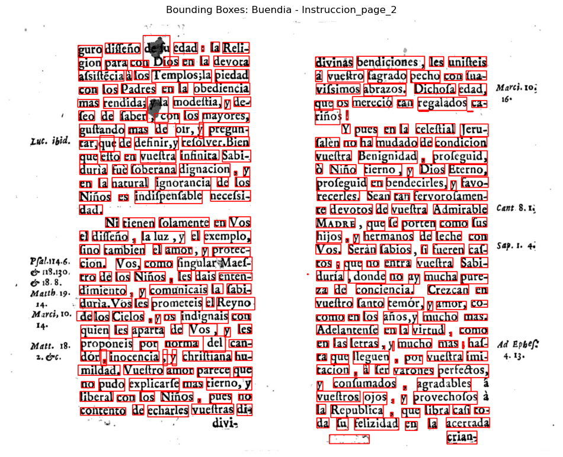

# Specific Test I. Layout Organization Recognition

## Project Overview  
This project focuses on the development of a Layout Organization Recognition model aimed at analyzing scanned pages and identifying the main text regions while ignoring non-informative elements such as page numbers, logos, and decorative embellishments. 

## Strategy

The pipeline is designed in multiple stages to generate a reliable dataset of main-text word images, which can be used to train an optical character recognition (OCR) model.

### 1. PDF Organization and Extraction
- All `.pdf` files are grouped into a central folder.
- Files are unzipped and organized for image extraction.

### 2. Image Conversion
- First 3 pages of each PDF are converted into `.png` images using `PyMuPDF`.
- Each PDF gets its own folder to maintain clean structure.

### 3. Word-Level OCR and Bounding Box Extraction
- Each image undergoes OCR (using `Tesseract`) to extract bounding box coordinates and words.
- Coordinates and recognized words are stored in separate `.txt` files.

### 4. Margin Filtering
- Bounding boxes outside estimated left/right text margins are discarded to filter out headers, footers, and side embellishments.

### 5. Cropped Word Image Generation
- The filtered bounding boxes are used to crop word-level images.
- Each cropped word image is saved using the OCR-detected word as the filename.

### 6. Transcript Alignment and Correction
- The ground truth transcript (from `.docx` files) is parsed and segmented by page.
- Word filenames are corrected using Levenshtein distance to match the closest transcript word, ensuring consistent naming and case handling.

### 7. Evaluation
- OCR is re-applied on each cropped word image.
- Predictions are normalized and compared with ground truth words.

## Evaluation

The performance of the Layout Organization Recognition model is evaluated by testing how accurately the preprocessing pipeline identifies and isolates words that belong to the **main body of text** on a scanned page.

Since the transcript `.txt` file contains **only words from the main text regions** (excluding embellishments, footers, headers, etc.), it serves as a reliable ground truth for evaluation. This allows us to assess whether the cropped word images truly correspond to meaningful, central content.

### Metric: Matching Accuracy

**Definition**:  
Matching Accuracy measures the proportion of OCR outputs from the cropped word images that exactly match the words listed in the main text transcript.

**Purpose**:  
This metric provides a direct measure of how well the preprocessing pipeline isolates content that belongs to the main layout, and how cleanly each word is captured for OCR recognition.

**Steps**:
1. Each cropped word image is passed through Tesseract OCR.
2. The OCR result is normalized (converted to lowercase and stripped of punctuation).
3. The normalized word is compared against the set of transcript words.
4. If a match is found, it is considered correct.

**Formula**:  
```
Accuracy = (Number of Matched Predictions / Total Valid OCR Predictions) × 100
```

- *Matched Prediction*: OCR result (after normalization) is found in the transcript `.txt` file.
- *Valid Prediction*: OCR result is non-empty and contains at least one alphanumeric character.

### Additional Quality Checks

The evaluation includes supporting diagnostics to ensure reliability:
- **Bounding Box–Word Count Mismatch**: Alerts when the number of OCR-detected boxes doesn’t match the number of stored words.
- **Unmatched Predictions**: Highlights words for which no corresponding transcript match was found.
- **Duplicate Assignments**: Ensures each transcript word is used only once during filename correction.

## Next Steps

This project presents a complete pipeline that functions as a **Layout Organization Recognition model** by detecting and isolating the main text regions from scanned documents, effectively disregarding embellishments and peripheral content.

Future enhancements can focus on:

- **Improving OCR Accuracy**: Incorporating a custom-trained OCR model to better handle non-ASCII characters such as "ñ", and reduce transcription errors.
- **Expanding Language Support**: Adapting the pipeline for multilingual document recognition.
- **Integrating Learning-Based Components**: Embedding self-supervised or transformer-based models to further automate and generalize layout understanding across diverse document formats.
- **Full-Page Region Segmentation**: Evolving from word-level isolation to broader region-level segmentation of paragraphs, columns, and headers using spatial clustering or learning-based region proposals.


## Results and Insights

The evaluation was conducted on a sample set of cropped word images from a scanned document. The following metrics were observed:

- **Total word images processed**: 209  
- **Valid OCR predictions made**: 193  
- **Predicted words matched in transcript**: 101  
- **Matching Accuracy**: 52.33%

### Observations

One major factor affecting the accuracy is the inability of the default OCR engine to correctly identify **non-ASCII characters**, such as the letter **"ñ"**. These mismatches often occur even when the bounding boxes and image quality are acceptable.

### Suggested Improvement

To improve the matching accuracy, we propose using a **custom-trained OCR model** that is fine-tuned to recognize extended character sets, including accented characters and language-specific glyphs. This enhancement would enable more accurate transcription and better alignment with the ground truth, particularly in multilingual documents.


## Visual Example

The image below shows a scanned document page with bounding boxes drawn **only around the main text regions**. These boxes were generated using margin filtering and OCR alignment as part of the Layout Organization Recognition model:


